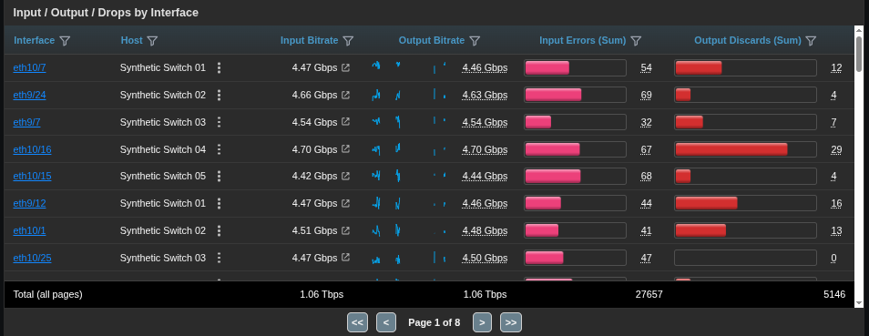
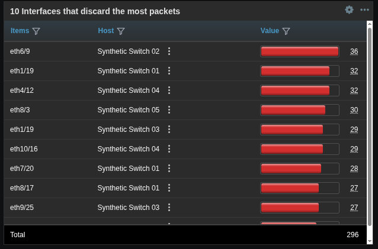
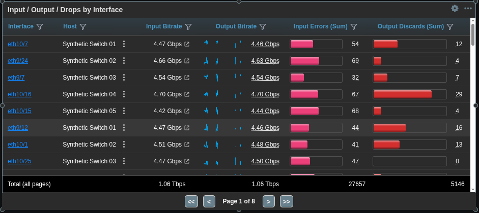
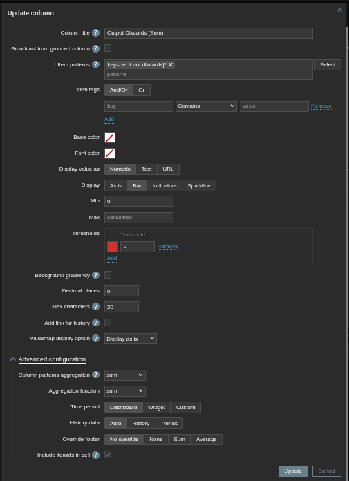
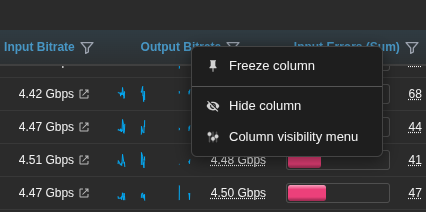
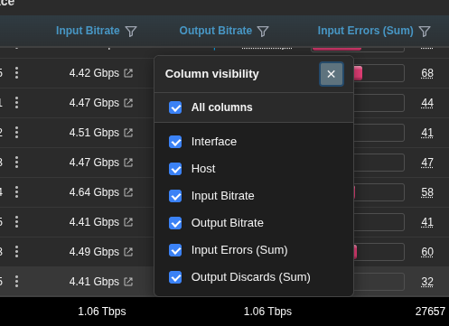
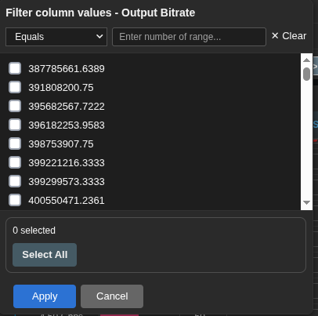
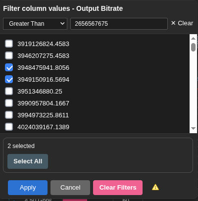
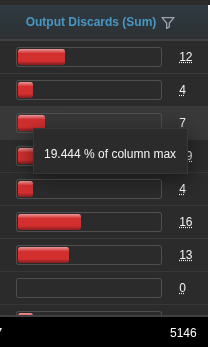
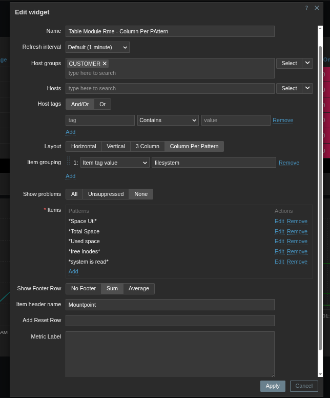

# 📊 RME Table Widget for Zabbix

A powerful, feature-rich table widget for Zabbix dashboards — built to fill the gap left by native visualizations and designed for both operators and end-users.

> 📺 [Training & Demo Videos](https://www.youtube.com/playlist?list=PLVBaXiAwXB7GKKJ_4eoQuOkan9SPfzEVs)

---

## 🖼️ Preview



---

## 📦 Requirements

| Zabbix Version | Branch |
|----------------|--------|
| 7.0 | `7.0` |
| 7.2 | `7.2` |
| 7.4 | `7.4` |

> ⚠️ Clone the branch that matches your Zabbix version.

---

## 🛠️ Installation

```bash
# Clone into Zabbix modules directory
git clone -b 7.2 https://github.com/yourrepo/rme-table-widget \
  /usr/share/zabbix/ui/modules/rme-table-widget
```

Then in Zabbix UI:  
**Administration → General → Modules → Scan directory → Enable "RME Table"**

---

## ⚡ Features

<details>
<summary><strong>📐 Layout Modes</strong></summary>

<br>

Two new **`Layout`** modes give you flexibility for different use cases:

**3 Column (Top/Bottom N)**  
Classic `Metric | Host | Value` layout. Best for ranked views or true Top N / Bottom N displays of values across all hosts.



**Column-per-Pattern**  
One column per configured item pattern. This is the most flexible layout and the recommended choice for any metrics created by Low-Level Discovery. Each item added in the **`Items`** section creates a new column.

Supports **`Item grouping`** by:
- Item tags
- `{HOST.HOST}` macro — produces a layout similar to a **`Horizontal`** layout table

> 💡 Heavy use of item tags unlocks the full power of this mode.



</details>

---

<details>
<summary><strong>🔗 Dashboard Communication Framework</strong></summary>

<br>

This widget is fully integrated with the [Zabbix dynamic parameters framework](https://www.zabbix.com/documentation/7.2/en/manual/web_interface/frontend_sections/dashboards/widgets#dynamic-parameters).

**Receives broadcasts of:**
- Host groups
- Hosts
- Items

**Broadcasts on cell click:**
- Host IDs
- Item IDs
- Multi-cell selection via `Ctrl+Click` or `Shift+Click` (item cells only) → broadcasts all selected item IDs

> 💡 Broadcasting multiple items is only compatible with other [RME Widgets](https://www.github.com/gryan337).

**Additional controls:**
- **`Auto select first cell`** — Will find the first clickable host and item cells and automatically select them when the widget loads. Otherwise, nothing is selected.
- **`Reset row`** *(deprecated)* — broadcasts `hostid: 000000` to reset all hosts broadcasted to linked widgets.
  - You can click an already-selected host cell again to achieve the same result.
- **`Show item grouping only`** — transforms this widget into a pure dashboard filter. Selecting a grouping broadcasts to all connected [RME Widgets](https://www.github.com/gryan337), including other table widgets.

</details>

---

<details>
<summary><strong>🗂️ Column Management</strong></summary>

<br>

Each item pattern is fully customizable from the configuration form and interactively within the dashboard.

**Configuration:**



**Interactive column controls (right-click any column header):**
- **Freeze column** — pin it to the left while scrolling horizontally
- **Hide column** — remove it from view without deleting its configuration
- **Column visibility menu** — also accessible via the ⋮ actions menu in the top-right of the widget panel




> 💡 Hidden columns retain their column filters, but those filters are suspended until the column is unhidden.

</details>

---

<details>
<summary><strong>🔍 Column Filtering</strong></summary>

<br>

Every column supports independent filtering. A **green funnel icon** indicates an active filter on that column.





**Available filter types:**

| Type | Description |
|------|-------------|
| Contains / Not Contains | Substring match |
| Equals | Exact match |
| Starts With / Ends With | Prefix/suffix match |
| Wildcard | `*` patterns |
| Regex | Full regular expression |
| Boolean Expression | Logical combinations |
| Numeric filters | `=`, `>`, `<`, `>=`, `<=`, range — for fully numeric columns, regex |

**Column filter popup controls:**

| Control | Behavior |
|---------|----------|
| Filter type dropdown | Sets the filter mode (Contains, Regex, Numeric, etc.) |
| Search input box | Reduces the value list as you type based on the selected filter type. No checkbox required — matching values are applied on `Apply` |
| `Clear` (top right) | Clears the search input and unchecks all checkboxes in one click |
| Checkbox list | Select specific values to filter. **Checkbox selections take precedence over search input text** |
| Select/Uncheck all | Toggles all currently visible checkboxes at once |
| `Apply` | Applies the combined state of the filter type, search input, and any checked boxes |
| `Cancel` | Discards all changes and restores the previous filter state |
| `Clear filters` | Visible when a search string or checkbox is active. Removes all filters; if a filter is currently active in the table, also clears it after clicking `Apply` |
| ⚠️ warning icon | Appears when both a search string and checkboxes are active — reminds you that checkboxes take precedence |

> 💡 Multiple column filters can be active simultaneously. Since filtering is entirely client-side (no server round-trips), it's worth setting **`Item ordering`** and **`Host ordering`** generously so all data is available in the browser for filtering.

> ⚠️ While a column filter popup is open, the widget will not refresh until the popup is closed.

</details>

---

<details>
<summary><strong>📊 Aggregations & Footer Row</strong></summary>

<br>

- **`Show footer row`** displays **Sum** or **Average** across all visible rows.
  - When column filters are applied, the footer recalculates based on visible rows only.
  - When there are multiple table pages, the footer is visible on all pages and reflects the **Sum** or **Average** across all pages.
- Per-column aggregation overrides: **Sum**, **Avg**, **Min**, **Max** — applied per table cell.
- **`Aggregate all hosts`** — merges values across multiple hosts/items into a single cell, enabling arbitrary aggregations of metric values.
  - All item IDs are encoded in these cells. Clicking one broadcasts all item IDs to connected widgets.

</details>

---

<details>
<summary><strong>📈 Bar Gauge enhancements</strong></summary>

<br>

Rows or columns can display inline **bar gauges** showing proportional values. A few configuration settings control how proportions are displayed:

- **`Bar gauge layout`** — proportions can be calculated within each **`Column`** or by **`Row`**.
- **`Bar gauge tooltip`** — when hovering over a bar gauge, shows the percentage relative to other bar gauges in the same column or row (based on **`Bar gauge layout`**). The percentage can be relative to the maximum value or the sum of values in the **`Column`** or **`Row`**.



</details>

---

<details>
<summary><strong>🔗 URL Display Mode</strong></summary>

<br>

Columns can be configured to render item values as **clickable URLs**.

In the column form, set **`Display as`** to **`URL`**, then configure **`URL display mode`**:

- **`As-is`** — use this when the metric value itself is already a properly formatted URL.
- **`Custom`** — allows you to transform or fully customize the URL.
  - To keep the metric value as the URL but override the display text, enter a value in **`URL display override`**.
  - To build a fully custom URL, use the **`URL customization`** field — supports built-in and user macros.

</details>

---

<details>
<summary><strong>🧰 Additional Features</strong></summary>

<br>

| Feature | Details |
|---------|---------|
| **Sortable columns** | Correctly handles all custom Zabbix units: `B`, `bps`, `s`, `unixtime`, etc. Sorting tens of thousands of table rows takes sub-100ms to complete allowing for enterprise level performance |
| **Pagination** | Automatic after 75 rows |
| **Customize item names** | Available in all layouts except **`Column per pattern`**. Supports Zabbix built-in macros. Set via the **`Metric label`** field |
| **Select host from storage** | Allows a host selected on one dashboard tab to be automatically selected on another dashboard tab when cycling through dashboard tabs - MUST be set in each RME Table that you want to participate |
| **Value map display** | Configure how mapped values are rendered per column/item pattern |
| **Add link for history** | Allows for one-click navigation to the historical values - this is the same page that `Latest data` takes you to when clicking `History` on the far right |
| **CSV export** | Download table data from the actions menu |
| **Lazy loading** | Configurable toggle to show/hide data on demand. Found in the main configuration form under **`Advanced configuration`** → **`Display on click`** |
| **Background gradiency** | Improve contrast and visual aesthetics by enabling gradient color backgrounds |
| **Font color** | Adds ability to choose font color |
| **Topitems** | Maintains all capabilities from the [Topitems](https://www.zabbix.com/documentation/current/en/manual/web_interface/frontend_sections/dashboards/widgets/top_items) widget, including custom sort ordering when the widget first loads, bar gauges, sparkline graphs, dynamic cell shading based on thresholds, automatic cell highlight when a trigger/alert is active

</details>

---

## ⚙️ Configuration

<details>
<summary><strong>Main Configuration Form</strong></summary>

<br>



<!--
TODO: Describe key fields here — host groups, item patterns, layout selection, etc.
-->

</details>

<details>
<summary><strong>Column Configuration Form</strong></summary>

<br>


<!--
TODO: Describe column-level options — display type, aggregation, header macros, URL mode, etc.
-->

</details>

---

## 🗺️ Roadmap

<details>
<summary><strong>View roadmap</strong></summary>

<br>

### ✅ Q1 2026
- [x] Draggable columns in configuration UI
- [x] Style improvements
- [x] Performance improvements — scales to 10,000s of rows / 100,000s of cells with minimal lag
- [x] Migrated client-side logic to PHP backend

### 🔜 Q2 2026
- [ ] Broadcast time period to listening widgets
- [ ] Add ability to group by Host tags
- [ ] Deprecate `{HOST.HOST}` in favor of an explicit option to group by `Hostname`
- [ ] Add more aggregation functions for `Column patterns aggregation` and for the `Show footer row`
- [ ] Crowd-sourced feature requests & community feedback (continuous)

### 📋 Q3 2026
- [ ] Crowd-sourced feature requests & community feedback (continuous)

</details>

---

## 🐛 Known Issues

- Ongoing code cleanup (reducing JS reliance; moving logic to PHP + CSS)
- Documentation expansion in progress

---

## ✍️ Background

Zabbix is a powerful monitoring platform, but end-users have historically struggled with its UI.  
This widget was originally cloned from the native [TopItems](https://www.zabbix.com/documentation/current/en/manual/web_interface/frontend_sections/dashboards/widgets/top_items) widget and significantly expanded to provide a flexible, production-grade table experience — and to push Zabbix's dashboard capabilities forward.
