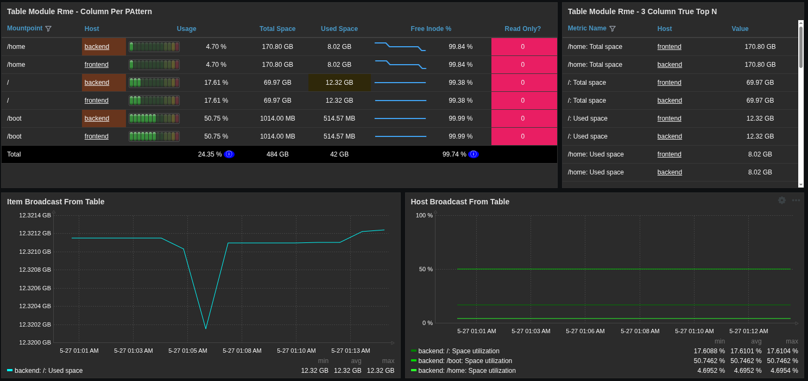
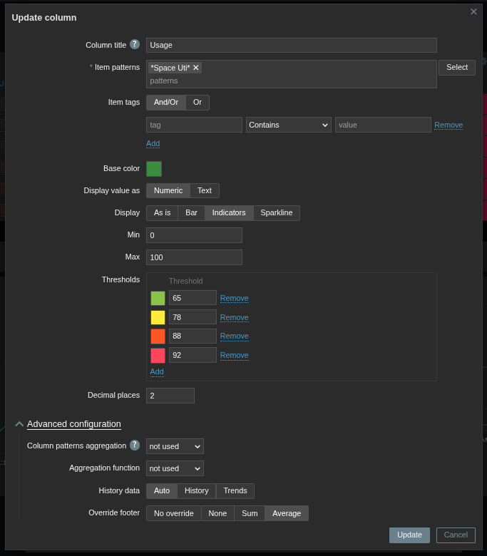
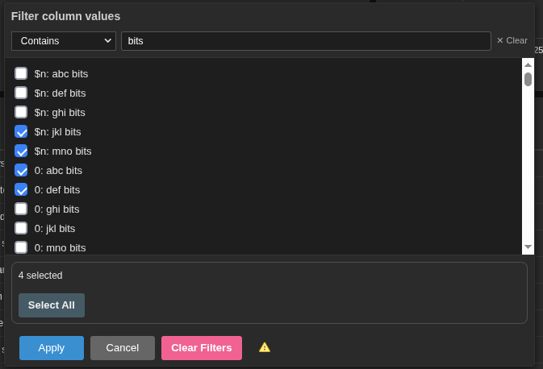

# Zabbix Custom Widget - Table
A table widget with advanced functionality for the Zabbix dashboard

## Overview

## Main Configuration Form

## Column Configuration Form

## Column Filtering

## Required Zabbix version

 - The branches of this widget correspond to the matching Zabbix branch. Please clone the branch version that matches your Zabbix version.
 - Available Versions:
   - 7.4
   - 7.2

## Purpose

- Zabbix is an incredibly powerful monitoring and observability platform, but one of the biggest complaints of customers and users has historically been usability of the UI and visualizations. After spending a lot of time with the tool I realized that the Zabbix UI is very friendly for developers or system administrators OF Zabbix, but not necessarily the users that might need metrics/data FROM Zabbix if that is the primary organization monitoring tool. Until recently, that is. Zabbix 6.4 brought an improved ability to write custom modules and widgets, but then Version 7.0 brought the communication framework for dashboards. This framework is a crucial step in truly making Zabbix the ultimate monitoring and observability platform. But what we need now is an improved ecosystem of visualizations for the dashboard with many flexible ways to control what we see in the dashboard. Since I come from a background where we monitoring thousands of hosts and millions of unique metrics (items) the data table is a crucial widget to show the most information in a small space: the dashboard. But even after the introduction of [TopItems](https://www.zabbix.com/documentation/current/en/manual/web_interface/frontend_sections/dashboards/widgets/top_items) by Zabbix, many things were missing to create a truly powerful experience. That is why I made this widget.

## Authors notes

- This widget was originally cloned from the [TopItems](https://www.zabbix.com/documentation/current/en/manual/web_interface/frontend_sections/dashboards/widgets/top_items) widget, because there is a lot of good functionality built into it. However, my widget adds a significant amount of new features to enhance this widget greatly. My hope is that this work will be immediately useful to the community, spark interest to help improve this widget, and perhaps even gain the attention of Zabbix themselves to take the code I've written and build it into Zabbix natively. 

## Future Development

 - This widget is not done and still needs to address some bugs and polishing of the code. But, I have been working on this for about 4 months in my spare time and kept running into new issues or bugs that left me saying "let me just fix this before putting it out on Git". I honestly think the widget is super useful right now that the few issues that are present don't warrant delaying this any longer.
 - There are several known issues in this widget that could be polished, and will outlined below. My intent is to keep this updated as best as possible.
 - Expand column filtering to all columns. Add more filter type conditions.
 - Add a light mode theme for the column filtering popup.

## Functionality and Features

 - Adds 2 new table layout options, called 3 Column and Column per pattern
 - 3 Column provides a true Top/Bottom N table where the first column is the metric name, the second column is the host and the third column is the value. This provides an ordering capability across hosts.
 - Column per pattern creates a single column per pattern added. That is, each time you click the 'Add' button in the configuration form next to the 'Items' label this will become a new column.
 - Column per pattern item grouping is done by tags. There is a special grouping value you can enter as well to create a layout similar to Horizontal, by adding '{HOST.HOST}' as the value to group by
 - This table widget can receive broadcasted input of host groups and hosts from other dashboard widgets. This widget will broadcast hosts and items to other widgets by clicking table cells. Thus, this widget fully leverages the [communication framework](https://www.zabbix.com/documentation/current/en/manual/web_interface/frontend_sections/dashboards/widgets#dynamic-parameters) developed by the Zabbix company. This was an important addition as it allows for one table to control another table, graphs, etc.
 - Every table column can be sorted. The sort functionality correctly sorts almost all Zabbix items, including those with units in 'B', 'bps', 's', 'unixtime', etc. 
 - Table pagination was added automatically after 75 rows
 - Column filtering is possible in the first column by clicking the funnel icon. Several filter type options are available like Contains, Equals, Starts with, Ends with, wildcard, Does not contain and Regex. The behavior is as such: If any checkbox is selected, clicking the Ok button will use the checkbox. If no checkbox is selected the filter string in the search input box will be applied using the filter type selected from the dropdown. When a filter is applied the funnel icon will highlight green. When using the Regex search type, if an invalid regular expression is detected the funnel will be highlighted red.
 - A footer row showing the Total (Sum) or Average is possible. When using a layout of Column per pattern each column can be individually overridden in the column edit's Advanced Configuration section
 - You can perform aggregations within column cells when using the Column per pattern layout. For example, this is useful if you have several similar metrics for many hosts but you just want to display their sum, or average (i.e. all NIC ingest rates or the minimum value of a particular sensor on all CPUs or DIMMS on a server). Note that when using Column patterns aggregation it disables the item broadcasting to other widgets (why? because the framework can only transmit one itemid right now).
 - The Item header row field option on the main configuration form allows for customizing the 'Items' header to something more meaningful.
 - The Add reset row is intended to be a future capability. It broadcasts a hostid of '000000' which is not a hostid that will ever be used. This was added because I have modified the SvgGraph in one customer environment to intercept the '000000' hostid in the javascript and handle that in a special way that causes their graphs to reset back to a default view. Their use case was, when going to a dashboard they wanted to see the aggregate switch rate across all switch ports. So the graph widget was configured to show that by default. But my table widget presents each interface (in Zabbix as hosts). with columns showing ingest rate, egress rate and discards. When they click a host (interface) of interest from the table, using the override host feature of Zabbix version 7.2, it changes the display to the interface. But with the graph widget, there isn't any resetting back to the original view, so this was added.
 - The Metric label form field allows to customize item names using the built in macro resolving functions of the Core Zabbix code. For example, a common use case would be to take something like "/home: Total space" and convert it to "/home" and put "Total space" as a column header. You can achieve that by applying {{ITEM.NAME{.regrepl(": Total space", "")} to that field. This field behaves exactly like 'text' field in the Honeycomb widget in Advanced Configuration -> Primary label -> text.

## Installation Instructions

 - Clone this repo into the `ui/modules/` folder (standard path is `/usr/share/zabbix/ui/modules/` from RPM installations)
 - Go to Zabbix URL -> Administration -> General -> Modules
 - Select `Scan directory` from the top right of the page
 - Find the `Table` widget and enable it on the right

## Known Issues and Things I'd like to polish

 - Add a help tooltip in the column filter for each dropdown element. Add more dropdown options?
 - Polish the code.... a lot. Much of the work was done in javascript, but much of it could be moved to PHP classes/function and CSS. But again, the widget is highly useful today, so code cleanup can wait
 - Better documentation on this page.

# 🚀 Project Roadmap

A high-level view of our project milestones and upcoming goals.

---

## 📍 September 2025

- [ ] Add the ability to broadcast multiple itemids and tags to other widgets on this github (piechart, graph, and this widget)  
- [ ] Enable multi-selection of table cells with ctrlkey and shiftkey allowing for highly customizable drill-downs in the Zabbix dashboards  
- [ ] Allow for bar gauges to show proportions in the table rows or table columns, allowing the user full control of the table orientation  
- [ ] Allow columns to be draggable (click + drag) in the initial configuration of the widget  

---

## 🛠️ Upcoming (Q4 2025)

| Milestone | Status | Target |
|-----------|--------|--------|
| Crowd sourced feature requests and always accepting user feedback/requests | Upcoming | October 2025 |

---
